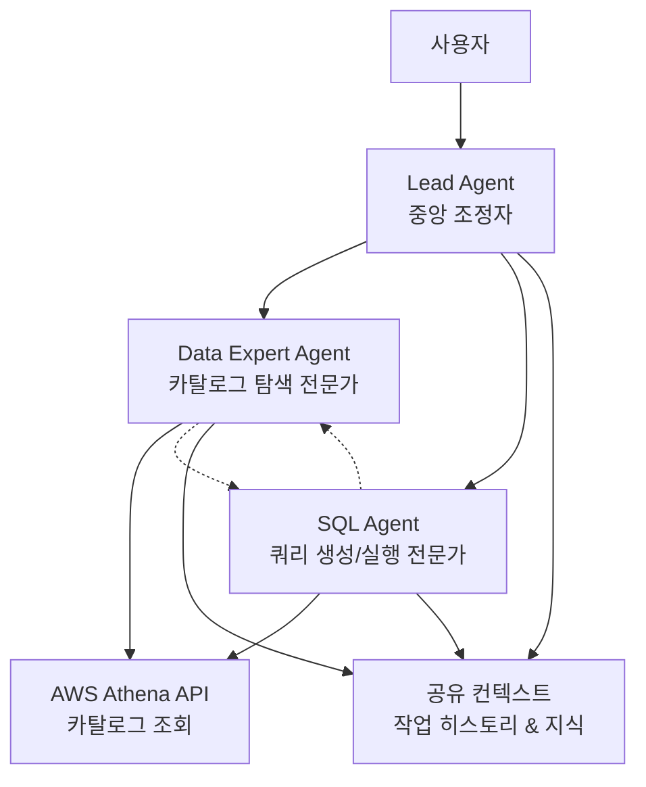

# Multi-Agent Text2SQL System Design

## Overview

현재 단일 text2sql 에이전트를 3개의 전문화된 에이전트로 분리하여 Strands Swarm 패턴을 사용한 협업 시스템으로 재구성합니다. 각 에이전트는 특정 도메인에 집중하여 더 나은 성능과 유지보수성을 제공하며, 자율적인 협업을 통해 복잡한 데이터 분석 작업을 수행합니다.

## Architecture

### High-Level Architecture



### Swarm Pattern Implementation

시스템은 Strands Swarm 패턴을 사용하여 다음과 같이 구성됩니다:

1. **자율적 협업**: 각 에이전트가 필요에 따라 다른 에이전트에게 작업을 전달
2. **공유 컨텍스트**: 모든 에이전트가 작업 히스토리와 지식을 공유
3. **동적 작업 분배**: 에이전트의 전문성에 따라 작업이 자동으로 분배
4. **handoff_to_agent 도구**: 에이전트 간 제어 전달을 위한 도구

## Components and Interfaces

### 1. Lead Agent (중앙 조정자)

**역할**: 사용자 요청을 받아 전체 워크플로우를 조정하고 최종 결과를 통합

**주요 기능**:
- 사용자 자연어 요청 분석 및 의도 파악
- 적절한 전문 에이전트로 작업 위임
- 에이전트 간 협업 조정
- 최종 결과 통합 및 사용자 응답 생성
- 오류 처리 및 상태 관리

**도구**:
- `handoff_to_agent`: 다른 에이전트로 제어 전달
- 기존 이벤트 시스템 통합

### 2. Data Expert Agent (데이터 카탈로그 전문가)

**역할**: AWS Athena 데이터 카탈로그를 탐색하고 LLM을 통해 비즈니스 요구사항에 적합한 테이블 식별

**주요 기능**:
- 데이터베이스 목록 조회 (`list_databases`)
- 테이블 메타데이터 수집 (`list_table_metadata`)
- 테이블 스키마 분석 (`get_table_metadata`)
- **LLM 기반 테이블 매칭**: 비즈니스 요구사항과 테이블 스키마를 LLM이 분석하여 적합한 테이블 추천
- 파티션 키 및 최적화 힌트 제공

**테이블 매칭 방식**:
- Rule-based 키워드 매핑 대신 Strands Agent의 LLM이 직접 테이블 적합성 판단
- 사용자 자연어 쿼리와 테이블 스키마(컬럼명, 타입, 파티션 키)를 LLM에게 제공
- LLM이 비즈니스 의도를 해석하고 가장 적합한 테이블 선택

**도구**:
- `manage_aws_athena_data_catalogs`
- `manage_aws_athena_databases_and_tables`
- `handoff_to_agent`

### 3. SQL Agent (쿼리 생성/실행 전문가)

**역할**: Data Expert로부터 받은 카탈로그 정보와 사용자 자연어 쿼리를 기반으로 LLM이 SQL을 생성하고 Athena에서 실행

**주요 기능**:
- **LLM 기반 SQL 생성**: 카탈로그 정보(테이블 스키마, 컬럼, 파티션 키)를 시스템 프롬프트에 포함하여 LLM이 비즈니스 의도를 해석하고 SQL 생성
- 쿼리 최적화 힌트 활용 (파티션 키, 날짜 컬럼 정보 기반)
- Athena 쿼리 실행 (`start_query_execution`)
- 실행 상태 모니터링 (`get_query_execution`)
- 결과 조회 및 포맷팅 (`get_query_results`)

**SQL 생성 방식**:
- Rule-based 키워드 매핑 대신 Strands Agent의 LLM이 직접 SQL 생성
- Data Expert가 제공한 테이블 정보를 컨텍스트로 활용
- 비즈니스 의도(entity, metric, time, action)를 LLM이 자연어에서 해석

**도구**:
- `manage_aws_athena_query_executions`
- `manage_aws_athena_workgroups`
- `handoff_to_agent`

## Data Models

### Swarm Configuration

```python
@dataclass
class SwarmConfig:
    max_handoffs: int = 20
    max_iterations: int = 20
    execution_timeout: float = 900.0  # 15분
    node_timeout: float = 300.0       # 5분
    repetitive_handoff_detection_window: int = 8
    repetitive_handoff_min_unique_agents: int = 3
```

### Shared Context Data

```python
@dataclass
class AnalysisContext:
    user_query: str
    business_intent: Dict[str, Any]  # entity, metric, time, action
    identified_tables: List[TableInfo]
    generated_sql: Optional[str]
    query_execution_id: Optional[str]
    results: Optional[List[Dict]]
    error_messages: List[str]
    
@dataclass
class TableInfo:
    database: str
    table: str
    columns: List[ColumnInfo]
    partition_keys: List[str]
    relevance_score: float
    
@dataclass
class ColumnInfo:
    name: str
    type: str
    description: Optional[str]
```

### Agent Interfaces

```python
class MultiAgentText2SQL:
    def __init__(self, model_id: str):
        self.swarm = self._create_swarm()
        self.event_queue = queue.Queue()
        self.ui_state = StreamlitUIState()
    
    def stream_response(self, user_input: str) -> Generator[Dict[str, Any], None, None]:
        """기존 인터페이스 호환성 유지"""
        pass
    
    def get_ui_state(self) -> StreamlitUIState:
        """기존 UI 상태 인터페이스 유지"""
        pass
```

## Correctness Properties

*A property is a characteristic or behavior that should hold true across all valid executions of a system-essentially, a formal statement about what the system should do. Properties serve as the bridge between human-readable specifications and machine-verifiable correctness guarantees.*

Property 1: Lead Agent 작업 위임 일관성
*For any* 자연어 쿼리 입력에 대해, Lead Agent는 요청을 분석하고 적절한 전문 에이전트로 작업을 위임해야 한다
**Validates: Requirements 1.1**

Property 2: 결과 통합 완전성
*For any* 완료된 멀티에이전트 작업에 대해, Lead Agent의 통합 결과는 모든 개별 에이전트 결과를 포함해야 한다
**Validates: Requirements 1.2**

Property 3: 공유 컨텍스트 정보 전달
*For any* 에이전트 간 협업 상황에서, 공유 컨텍스트를 통해 정보가 올바르게 전달되어야 한다
**Validates: Requirements 1.3**

Property 4: 에러 처리 응답 완전성
*For any* 에러 상황에서, Lead Agent의 응답은 명확한 오류 메시지와 다음 단계 제안을 포함해야 한다
**Validates: Requirements 1.4**

Property 5: 작업 상태 표시 정확성
*For any* 작업 진행 상황 확인 요청에 대해, 상태 표시는 현재 작업 중인 에이전트 정보를 포함해야 한다
**Validates: Requirements 1.5**

Property 6: 데이터 카탈로그 조회 수행
*For any* 데이터 탐색 요청에 대해, Data Expert Agent는 AWS Athena 카탈로그 조회를 수행해야 한다
**Validates: Requirements 2.1**

Property 7: 테이블 메타데이터 수집 제한 준수
*For any* 테이블 목록 조회에서, Data Expert Agent가 수집하는 메타데이터는 데이터베이스당 최대 50개를 초과하지 않아야 한다
**Validates: Requirements 2.2**

Property 8: LLM 기반 테이블 추천
*For any* 비즈니스 요구사항 매칭에서, Data Expert Agent는 Strands Agent의 LLM을 통해 테이블 스키마를 분석하고 적합한 테이블을 추천해야 한다
**Validates: Requirements 2.3**

Property 9: 메타데이터 분석 최적화 힌트 제공
*For any* 테이블 메타데이터 분석에서, Data Expert Agent는 파티션 키와 SQL 최적화 힌트를 제공해야 한다
**Validates: Requirements 2.5**

Property 10: 카탈로그 정보 컨텍스트 포함
*For any* Data Expert로부터 받은 카탈로그 정보에 대해, SQL Agent의 시스템 프롬프트는 테이블 스키마, 컬럼 정보, 파티션 키를 포함해야 한다
**Validates: Requirements 3.1**

Property 11: LLM 기반 SQL 쿼리 생성
*For any* 사용자 자연어 쿼리와 카탈로그 정보에 대해, SQL Agent는 Strands Agent의 LLM을 통해 유효한 Athena SQL 쿼리를 생성해야 한다
**Validates: Requirements 3.2**

Property 12: 쿼리 실행 ID 저장
*For any* 쿼리 실행에서, SQL Agent는 start_query_execution 호출 후 QueryExecutionId를 저장해야 한다
**Validates: Requirements 3.3**

Property 13: 폴링 규칙 준수
*For any* 쿼리 실행 상태 확인에서, SQL Agent는 5초 간격으로 최대 5회 폴링 규칙을 준수해야 한다
**Validates: Requirements 3.4**

Property 14: 결과 행 수 제한
*For any* 성공한 쿼리에 대해, SQL Agent가 반환하는 결과는 최대 1000행을 초과하지 않아야 한다
**Validates: Requirements 3.5**

Property 15: 작업 전달 도구 사용
*For any* 에이전트 작업 전달에서, 시스템은 handoff_to_agent 도구를 사용해야 한다
**Validates: Requirements 4.2**

Property 16: 공유 상태 전파
*For any* 공유 상태 요청에서, 시스템은 invocation_state를 통해 컨텍스트와 설정을 전파해야 한다
**Validates: Requirements 4.3**

Property 17: 워크플로우 결과 통합
*For any* 완료된 워크플로우에서, 시스템의 통합 결과는 모든 개별 에이전트 작업 결과를 포함해야 한다
**Validates: Requirements 4.5**

Property 18: 인터페이스 호환성 - stream_response
*For any* MyCustomAgent 인터페이스 호출에서, Lead Agent는 stream_response 메서드를 제공해야 한다
**Validates: Requirements 5.1**

Property 19: 인터페이스 호환성 - get_ui_state
*For any* UI 상태 조회에서, Lead Agent는 get_ui_state 메서드를 제공해야 한다
**Validates: Requirements 5.2**

Property 20: 이벤트 시스템 호환성
*For any* 이벤트 처리에서, Lead Agent는 기존 이벤트 시스템과 호환되는 콜백을 제공해야 한다
**Validates: Requirements 5.3**

Property 21: 디버그 정보 통합
*For any* 디버그 모드 사용에서, Lead Agent의 디버그 정보는 모든 에이전트의 정보를 통합해야 한다
**Validates: Requirements 5.4**

Property 22: MCP 클라이언트 접근 관리
*For any* MCP 클라이언트 사용에서, Lead Agent는 AWS 데이터 처리 도구에 대한 접근을 올바르게 관리해야 한다
**Validates: Requirements 5.5**

## Error Handling

### 에이전트 레벨 에러 처리

1. **Data Expert Agent 에러**:
   - 카탈로그 접근 실패: 권한 확인 및 재시도 제안
   - 테이블 메타데이터 부족: 사용 가능한 테이블 목록 제시
   - 매칭 실패: 대안 테이블 및 수정된 검색 조건 제안

2. **SQL Agent 에러**:
   - 쿼리 생성 실패: 요구사항 명확화 요청
   - 실행 실패: SQL 구문 오류 및 수정 제안
   - 타임아웃: 쿼리 최적화 또는 범위 축소 제안

3. **Lead Agent 에러**:
   - 의도 파악 실패: 추가 정보 요청
   - 에이전트 통신 실패: 시스템 상태 확인 및 재시도

### Swarm 레벨 에러 처리

1. **무한 루프 방지**:
   - `max_handoffs`: 20회 제한
   - `repetitive_handoff_detection`: 8개 노드 윈도우에서 최소 3개 고유 에이전트 요구

2. **타임아웃 관리**:
   - 전체 실행: 15분 제한
   - 개별 에이전트: 5분 제한

3. **실패 복구**:
   - 에이전트 실패 시 Lead Agent로 제어 반환
   - 부분 결과 보존 및 사용자 안내

## Testing Strategy

### Unit Testing

각 에이전트의 핵심 기능에 대한 단위 테스트:

1. **Lead Agent 테스트**:
   - 자연어 의도 분석 정확성
   - 에이전트 선택 로직
   - 결과 통합 기능

2. **Data Expert Agent 테스트**:
   - 카탈로그 조회 기능
   - 테이블 매칭 알고리즘
   - 메타데이터 분석 정확성

3. **SQL Agent 테스트**:
   - SQL 생성 정확성
   - 쿼리 실행 플로우
   - 결과 포맷팅

### Property-Based Testing

**테스팅 프레임워크**: Hypothesis (Python)
**최소 반복 횟수**: 100회

각 correctness property에 대한 property-based 테스트를 구현하여 다양한 입력에 대한 시스템 동작을 검증합니다. 테스트는 다음과 같은 생성기를 사용합니다:

- 자연어 쿼리 생성기 (다양한 비즈니스 도메인)
- 테이블 스키마 생성기 (다양한 컬럼 타입과 구조)
- 에러 상황 생성기 (네트워크, 권한, 데이터 오류)

### Integration Testing

1. **Swarm 통합 테스트**:
   - 전체 워크플로우 실행
   - 에이전트 간 협업 검증
   - 공유 컨텍스트 동작 확인

2. **AWS Athena 통합 테스트**:
   - 실제 카탈로그 조회
   - 쿼리 실행 및 결과 검증
   - 에러 시나리오 테스트

3. **UI 통합 테스트**:
   - Streamlit 인터페이스 호환성
   - 이벤트 시스템 통합
   - 실시간 스트리밍 동작

## Implementation Notes

### Swarm 구성

```python
# 에이전트 생성 순서와 역할 정의
agents = [
    lead_agent,      # 진입점 (entry_point)
    data_expert,     # 데이터 탐색 전문가
    sql_agent        # SQL 생성/실행 전문가
]

swarm = Swarm(
    agents,
    entry_point=lead_agent,
    max_handoffs=20,
    max_iterations=20,
    execution_timeout=900.0,
    node_timeout=300.0,
    repetitive_handoff_detection_window=8,
    repetitive_handoff_min_unique_agents=3
)
```

### 공유 상태 관리

```python
invocation_state = {
    "mcp_client": mcp_client,
    "aws_config": aws_config,
    "debug_mode": debug_enabled,
    "session_id": session_id
}
```

### 이벤트 시스템 통합

기존 Streamlit 이벤트 시스템과의 호환성을 위해 Swarm 이벤트를 기존 이벤트 형식으로 변환하는 어댑터 구현이 필요합니다.