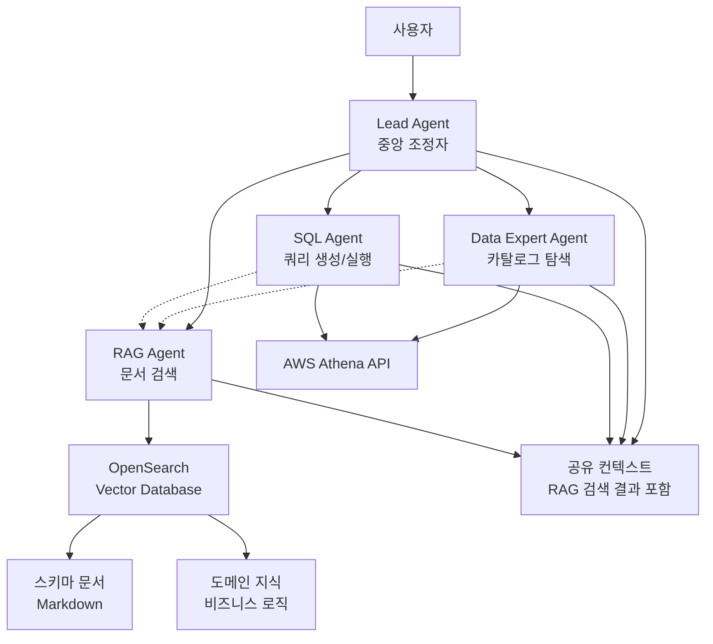

# RAG Agent Integration Design

## Overview

기존 멀티에이전트 Text2SQL 시스템(Lead Agent, Data Expert Agent, SQL Agent)에 RAG(Retrieval-Augmented Generation) Agent를 추가하여 벡터 데이터베이스에서 스키마 문서와 도메인 지식을 검색하고 활용합니다. RAG Agent는 Strands Swarm 패턴을 통해 다른 에이전트들과 협업하며, 특히 Data Expert Agent와 SQL Agent에게 추가 컨텍스트를 제공하여 더 정확한 테이블 매칭과 SQL 생성을 지원합니다.

## Architecture

### High-Level Architecture



### RAG Agent Integration Points

1. **Data Expert Agent → RAG Agent**:
   - 테이블 매칭 전에 스키마 문서 검색 요청
   - 검색된 문서를 통해 테이블/컬럼 설명 보강

2. **SQL Agent → RAG Agent**:
   - SQL 생성 전에 도메인 지식 검색 요청
   - 비즈니스 용어 → 데이터베이스 컬럼 매핑 정보 활용

3. **공유 컨텍스트**:
   - RAG 검색 결과를 `AnalysisContext`에 저장
   - 다른 에이전트들이 검색 결과 재사용 가능

## Components and Interfaces

### 1. RAG Agent

**역할**: 벡터 데이터베이스에서 관련 문서를 검색하여 다른 에이전트에게 컨텍스트 제공

**주요 기능**:
- 사용자 쿼리 임베딩 변환 (AWS Bedrock Titan Embeddings V2)
- OpenSearch k-NN 벡터 검색 (상위 10개 문서 반환)
- 스키마 문서 구조화 (테이블명, 컬럼명, 타입, 설명 추출)
- 도메인 지식 검색 (비즈니스 로직, 값 설명)
- 검색 결과를 공유 컨텍스트에 저장

**도구**:
- `search_schema_docs`: OpenSearch에서 스키마 문서 검색
- `search_domain_knowledge`: 비즈니스 로직 및 값 설명 검색
- `handoff_to_agent`: 다른 에이전트로 제어 전달

**인터페이스**:
```python
class RAGAgent(BaseMultiAgent):
    def __init__(
        self,
        model_id: str,
        opensearch_endpoint: str,
        opensearch_index: str = "schema_docs",
        embedding_model: str = "amazon.titan-embed-text-v2:0"
    ):
        self.opensearch_client = self._init_opensearch(opensearch_endpoint)
        self.index_name = opensearch_index
        self.embedding_model = embedding_model
        super().__init__(model_id, tools=[])
    
    def search_documents(
        self,
        query: str,
        doc_type: str = "schema",  # "schema" or "domain"
        top_k: int = 10,
        filters: Optional[Dict] = None  # database, table_name 필터
    ) -> List[SearchResult]:
        """OpenSearch에서 문서 검색 수행"""
        pass
    
    def extract_schema_info(
        self,
        documents: List[SearchResult]
    ) -> List[SchemaInfo]:
        """스키마 문서에서 구조화된 정보 추출"""
        pass
```

### 2. Vector Database (OpenSearch)

**구현**: AWS OpenSearch Service (벡터 검색 지원)

**저장 데이터**:
- 스키마 문서 (Markdown 형식)
  - 테이블명, 데이터베이스명
  - 컬럼 정보 (이름, 타입, 별칭, 설명)
  - 비즈니스 로직 및 값 설명
  - 예시: `bird-benchmark/data/mini_dev/markdown_descriptions/` 형식

**문서 구조 예시**:
```markdown
# Table: schools
**Database**: california_schools

## Columns
| Column | Alias | Type | Description |
|--------|-------|------|-------------|
| CDSCode |  | text | CDSCode |
| County |  | text | County name |
...

## Business Logic & Value Descriptions
### StatusType
- Active: The district is in operation...
- Closed: The district is not in operation...
```

**OpenSearch 인덱스 구조**:
```json
{
  "mappings": {
    "properties": {
      "table_name": {"type": "keyword"},
      "database": {"type": "keyword"},
      "content": {"type": "text"},
      "content_vector": {
        "type": "knn_vector",
        "dimension": 1024,
        "method": {
          "name": "hnsw",
          "engine": "nmslib"
        }
      },
      "columns": {"type": "text"},
      "business_logic": {"type": "text"}
    }
  }
}
```

**검색 방식**:
- 벡터 유사도 검색 (k-NN)
- 하이브리드 검색 (벡터 + 키워드)
- 필터링 (database, table_name)

### 3. 기존 에이전트 수정

**Data Expert Agent**:
- RAG Agent 호출 추가 (선택적)
- 검색된 스키마 문서를 LLM 컨텍스트에 포함

**SQL Agent**:
- RAG Agent 호출 추가 (선택적)
- 검색된 도메인 지식을 시스템 프롬프트에 포함

**Lead Agent**:
- RAG Agent를 Swarm에 등록
- RAG 실패 시 기존 워크플로우 계속 진행

## Data Models

### RAG 관련 데이터 모델

```python
@dataclass
class SearchResult:
    """벡터 검색 결과"""
    content: str
    score: float
    metadata: Dict[str, Any]
    source: str  # 문서 출처

@dataclass
class SchemaInfo:
    """스키마 문서에서 추출한 정보"""
    table_name: str
    database: str
    columns: List[ColumnDetail]
    description: str
    source_doc: str

@dataclass
class ColumnDetail:
    """컬럼 상세 정보"""
    name: str
    type: str
    description: str
    examples: List[str] = field(default_factory=list)

@dataclass
class DomainMapping:
    """도메인 용어 매핑"""
    business_term: str
    database_column: str
    table: str
    description: str
    usage_frequency: int = 0
```

### 공유 컨텍스트 확장

```python
@dataclass
class AnalysisContext:
    """기존 필드들..."""
    user_query: str = ""
    business_intent: Dict[str, Any] = field(default_factory=dict)
    identified_tables: List[TableInfo] = field(default_factory=list)
    generated_sql: Optional[str] = None
    query_execution_id: Optional[str] = None
    results: Optional[List[Dict]] = None
    error_messages: List[str] = field(default_factory=list)
    
    # RAG 관련 추가 필드
    rag_schema_results: List[SearchResult] = field(default_factory=list)
    rag_domain_results: List[SearchResult] = field(default_factory=list)
    rag_enabled: bool = True  # RAG 사용 여부
```

## Correctness Properties

*A property is a characteristic or behavior that should hold true across all valid executions of a system-essentially, a formal statement about what the system should do. Properties serve as the bridge between human-readable specifications and machine-verifiable correctness guarantees.*

Property 1: 쿼리 임베딩 변환
*For any* 스키마 검색 요청에 대해, RAG Agent는 사용자 쿼리를 임베딩 벡터로 변환해야 한다
**Validates: Requirements 1.1**

Property 2: 상위 10개 문서 반환
*For any* 벡터 검색 수행에서, RAG Agent가 반환하는 문서는 최대 10개를 초과하지 않아야 한다
**Validates: Requirements 1.2**

Property 3: 검색 결과 메타데이터 포함
*For any* 검색 결과에 대해, 각 문서는 관련도 점수와 메타데이터를 포함해야 한다
**Validates: Requirements 1.3**

Property 4: 빈 결과 처리
*For any* 검색 결과가 없는 경우, RAG Agent는 빈 결과와 대안 제안을 반환해야 한다
**Validates: Requirements 1.4**

Property 5: 스키마 정보 구조화
*For any* 스키마 문서 처리에서, RAG Agent는 테이블명, 컬럼명, 데이터 타입, 설명을 구조화된 형식으로 추출해야 한다
**Validates: Requirements 1.5**

Property 6: 도메인 지식 검색
*For any* 도메인 지식 검색 요청에 대해, RAG Agent는 비즈니스 용어와 관련된 문서를 반환해야 한다
**Validates: Requirements 2.1**

Property 7: 메트릭 정의 정보 포함
*For any* 메트릭 정의 검색에서, RAG Agent는 계산 공식, 사용 컬럼, 필터 조건을 포함한 정보를 반환해야 한다
**Validates: Requirements 2.2**

Property 8: 용어 매핑 제공
*For any* 용어 매핑 수행에서, RAG Agent는 비즈니스 용어를 데이터베이스 컬럼명으로 변환하는 매핑 정보를 제공해야 한다
**Validates: Requirements 2.3**

Property 9: 출처 및 신뢰도 포함
*For any* 도메인 지식 반환에서, RAG Agent는 출처 문서와 신뢰도 점수를 포함해야 한다
**Validates: Requirements 2.5**

Property 10: Swarm 등록
*For any* 시스템 초기화에서, Multi-Agent System은 RAG Agent를 Swarm에 등록하고 handoff 도구를 제공해야 한다
**Validates: Requirements 3.1**

Property 11: Data Expert 협업
*For any* 테이블 매칭 수행에서, Data Expert Agent는 RAG Agent에게 스키마 문서 검색을 요청할 수 있어야 한다
**Validates: Requirements 3.2**

Property 12: SQL Agent 협업
*For any* 쿼리 생성에서, SQL Agent는 RAG Agent에게 도메인 지식 검색을 요청할 수 있어야 한다
**Validates: Requirements 3.3**

Property 13: 공유 컨텍스트 저장
*For any* 검색 결과 반환에서, RAG Agent는 공유 컨텍스트에 검색 결과를 저장해야 한다
**Validates: Requirements 3.4**

Property 14: 실패 시 워크플로우 계속
*For any* RAG Agent 실행 실패에서, Multi-Agent System은 RAG 없이 기존 워크플로우를 계속 진행해야 한다
**Validates: Requirements 3.5**

## Error Handling

### RAG Agent 레벨 에러 처리

1. **OpenSearch 접근 실패**:
   - AWS 자격증명 확인
   - 엔드포인트 연결 확인
   - 재시도 (최대 3회) 또는 RAG 비활성화 모드로 전환
   - Lead Agent에게 실패 알림

2. **임베딩 생성 실패**:
   - AWS Bedrock 연결 확인
   - 쿼리 길이 확인 (최대 8192 토큰)
   - 실패 시 RAG 없이 진행

3. **검색 결과 없음**:
   - 대안 검색어 제안
   - 유사 문서 추천
   - 기존 워크플로우 계속 진행

4. **인덱스 없음**:
   - OpenSearch 인덱스 존재 확인
   - 인덱스 생성 가이드 제공
   - RAG 비활성화 모드로 전환

### 통합 레벨 에러 처리

1. **RAG Agent 타임아웃**:
   - 5분 제한 (node_timeout)
   - 타임아웃 시 기존 워크플로우 계속

2. **OpenSearch 연결 실패**:
   - 재시도 로직 (최대 3회)
   - 실패 시 RAG 비활성화 모드로 전환
   - 에러 로그 기록

3. **선택적 RAG 사용**:
   - `rag_enabled` 플래그로 제어
   - RAG 실패해도 전체 시스템은 정상 동작
   - 에러 로그 기록 및 모니터링

## Testing Strategy

### Unit Testing

1. **RAG Agent 테스트**:
   - 임베딩 생성 정확성
   - 벡터 검색 기능
   - 스키마 정보 추출
   - 도메인 지식 매핑

2. **통합 테스트**:
   - Data Expert + RAG 협업
   - SQL Agent + RAG 협업
   - 공유 컨텍스트 전달

3. **에러 시나리오 테스트**:
   - OpenSearch 연결 실패
   - 인덱스 없음
   - 검색 결과 없음
   - RAG 타임아웃

### Property-Based Testing

**테스팅 프레임워크**: Hypothesis (Python)
**최소 반복 횟수**: 100회

각 correctness property에 대한 property-based 테스트를 구현하여 다양한 입력에 대한 시스템 동작을 검증합니다. 테스트는 다음과 같은 생성기를 사용합니다:

- 자연어 쿼리 생성기 (다양한 비즈니스 도메인)
- 스키마 문서 생성기 (다양한 테이블 구조)
- 도메인 지식 생성기 (용어 매핑, 메트릭 정의)
- 에러 상황 생성기 (벡터 DB 오류, 검색 실패)

### Integration Testing

1. **End-to-End 워크플로우**:
   - 사용자 쿼리 → RAG 검색 → 테이블 매칭 → SQL 생성
   - RAG 없이 동작 확인
   - RAG 실패 시 복구 확인

2. **벡터 DB 통합**:
   - OpenSearch 연동
   - 실제 스키마 문서 인덱싱
   - 검색 성능 측정
   - 하이브리드 검색 테스트

## Implementation Notes

### 벡터 데이터베이스 선택

**OpenSearch** (선택됨):
- 장점: 
  - AWS 관리형 서비스
  - k-NN 벡터 검색 지원
  - 하이브리드 검색 (벡터 + 키워드)
  - 확장성 및 고가용성
- 사용 사례: 프로덕션 환경, 대규모 문서

**OpenSearch 설정**:
```python
opensearch_config = {
    "endpoint": "https://your-domain.region.es.amazonaws.com",
    "index": "schema_docs",
    "knn_settings": {
        "dimension": 1024,
        "method": "hnsw",
        "engine": "nmslib"
    }
}
```

### 임베딩 모델

**AWS Bedrock Titan Embeddings V2**:
- 모델: `amazon.titan-embed-text-v2:0`
- 차원: 1024 (기본값, 최대 1024)
- 최대 입력: 8192 토큰
- 비용: $0.00002 per 1K tokens (V1 대비 80% 저렴)
- 개선사항: 더 나은 검색 정확도, 다국어 지원 향상

### 문서 청크 전략

**OpenSearch 인덱싱 전략**:
```python
def prepare_document_for_indexing(markdown_file: str) -> Dict:
    """Markdown 문서를 OpenSearch 인덱싱 형식으로 변환
    
    - 테이블명, 데이터베이스명 추출
    - 컬럼 정보 파싱
    - 비즈니스 로직 섹션 추출
    - 전체 내용 임베딩 생성
    """
    pass

# 문서 구조
document = {
    "table_name": "schools",
    "database": "california_schools",
    "content": "전체 마크다운 내용",
    "content_vector": [0.1, 0.2, ...],  # 1024 차원
    "columns": "CDSCode, County, District, ...",
    "business_logic": "StatusType definitions, ..."
}
```

**검색 쿼리 예시**:
```python
# 하이브리드 검색 (벡터 + 키워드)
search_query = {
    "query": {
        "bool": {
            "should": [
                {
                    "knn": {
                        "content_vector": {
                            "vector": query_embedding,
                            "k": 10
                        }
                    }
                },
                {
                    "multi_match": {
                        "query": "school district",
                        "fields": ["content", "columns", "business_logic"]
                    }
                }
            ]
        }
    }
}
```

### Swarm 통합

```python
# RAG Agent를 Swarm에 추가
agents = [
    lead_agent,
    data_expert,
    sql_agent,
    rag_agent  # 새로 추가
]

swarm = Swarm(
    agents,
    entry_point=lead_agent,
    max_handoffs=20,
    max_iterations=20,
    execution_timeout=900.0,
    node_timeout=300.0
)
```

### 공유 상태 관리

```python
invocation_state = {
    "mcp_client": mcp_client,
    "aws_config": aws_config,
    "debug_mode": debug_enabled,
    "session_id": session_id,
    "rag_enabled": True,  # RAG 사용 여부
    "opensearch_endpoint": "https://your-domain.region.es.amazonaws.com",
    "opensearch_index": "schema_docs"
}
```

## Performance Considerations

### 검색 성능

- 벡터 검색: ~50-100ms (OpenSearch k-NN, 10K 문서 기준)
- 임베딩 생성: ~100-200ms (AWS Bedrock)
- 전체 RAG 호출: ~200-400ms

### 메모리 사용

- OpenSearch 인덱스: AWS 관리형 (별도 메모리 관리 불필요)
- 임베딩 캐시: ~10MB (최근 100개 쿼리)

### 최적화 전략

1. **임베딩 캐싱**: 동일 쿼리 재사용
2. **하이브리드 검색**: 벡터 + 키워드 조합으로 정확도 향상
3. **필터링**: database, table_name으로 검색 범위 축소
4. **비동기 처리**: RAG 검색을 백그라운드에서 수행
